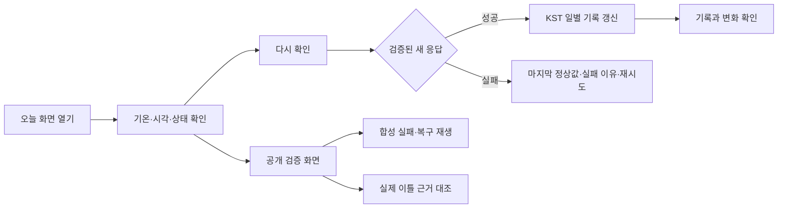
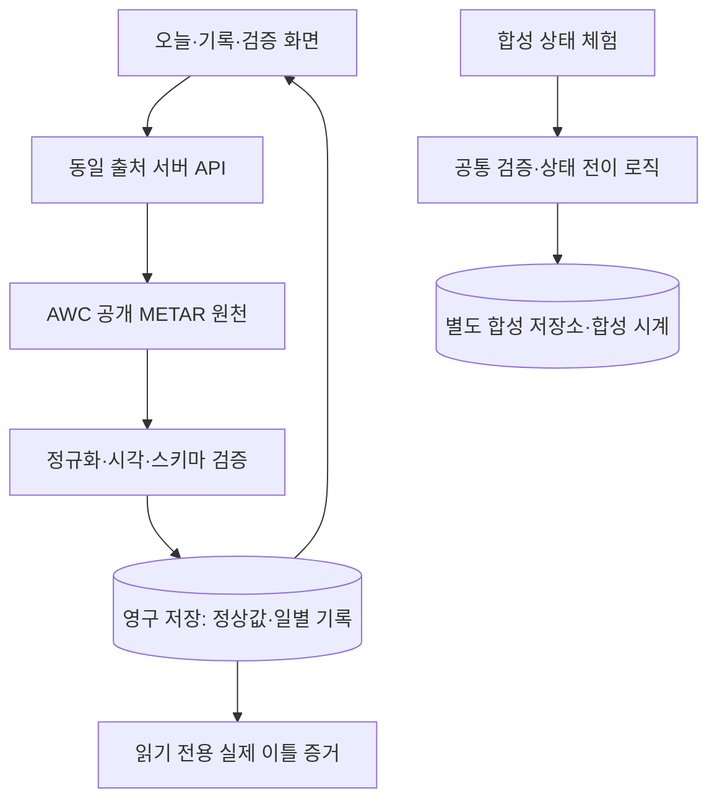

# ONDO — 오늘의 진짜 정보판

> 문서 상태 안내: 이 파일은 기온 주제의 최초 기획안입니다. 현재 우주 데이터 주제의 범위·우선순위·진행 조건은 [COSMIC PULSE 프로젝트 사전 검토서](D:/projects/real_info_board/PROJECT_PREFLIGHT_REVIEW.md)를 기준으로 확인하세요.

> 현행 시간 기준: 사용자가 실제 구현 작업시간 한도를 **24시간**으로 변경했습니다. 선행 기획·문서 작성 및 실제 날짜 대기는 제외합니다. 이 파일에 남은 최초 일정은 현재 적용하지 않습니다.

> 지금 확인한 기온, 어제와의 차이, 데이터가 멈춘 이유까지.

프로젝트: `real_info_board` · 기획 v1.0 · 작성일: 2026-09-09  
기준 문서: [constitution.txt](./constitution.txt), 과제 4 「오늘의 진짜 정보판 — 데이터가 안 올 때」  
문서 상태: **구현을 위한 기획안**. 서비스명·관측 지점·디자인·기술 구성은 제안이며, 구현·배포·실제 이틀 기록 검증은 아직 진행하지 않았다.

## 1. 만들고자 하는 경험

**ONDO는 서울 김포공항 관측 지점의 기온 하나를 매일 기록하고, 이전 기록과 비교하며, 조회에 실패해도 마지막 정상값과 실패 이유를 보여주는 모바일 중심 정보판이다.**

사용자는 첫 화면에서 “몇 도인지”, “언제 관측하고 가져온 값인지”, “현재 확인에 문제가 있는지”를 이해한다. 기록 화면에서는 어제와 오늘의 저장값을 직접 비교한다. 심사자는 공개 검증 화면에서 합성 실패와 복구, 실제 이틀의 근거를 재현한다.

핵심 약속은 세 가지다.

- **한눈에 이해한다.** 기온을 가장 크게, 비교와 상태를 그다음으로 보여준다.
- **값의 맥락이 따라다닌다.** 관측 지점·단위·출처·관측 시각·조회 시각·KST를 값과 함께 표시한다.
- **실패해도 정직하다.** 마지막 정상값을 보존하고, 오래된 값이라는 표시와 다음 행동을 제공한다.

초기 대상은 휴대폰으로 짧게 정보를 확인하려는 사용자다. 이는 기획 가설이며, 특정 세대 전체의 취향이나 검증된 사용자 조사 결과를 뜻하지 않는다.

## 2. constitution을 제품 원칙으로 적용하기

| 원문에서 지킬 원칙 | 제품에 적용할 결정 |
|---|---|
| 실제로 변하는 공개 값 하나 | 김포공항 `RKSS`의 기온만 사용한다. 단위는 `°C`다. |
| 값·단위·출처·두 시각·시간대 | 홈의 기온 영역 바로 아래에 펼쳐서 표시한다. |
| 원자료·저장값·화면값 일치 | 하나의 검증된 정규화 값을 저장·표시·비교에 사용한다. |
| 비밀값 없는 호출 | 키 없는 공개 원천을 서버가 조회한다. 공개 응답에는 허용한 데이터만 포함한다. |
| 실패 다섯 종류 구분 | 느림·원천 접근 거절·호출 제한·오프라인·형식 변경에 서로 다른 설명과 행동을 제공한다. |
| 마지막 정상값 보존 | 실패 처리가 정상값과 정상 조회 시각을 덮어쓰지 않는다. |
| 같은 KST 날짜는 한 건 | 성공 조회 날짜를 일별 고유키로 사용하고 유효한 최신 성공으로 갱신한다. |
| 실제 서로 다른 날짜의 기록 두 건 | 연속된 실제 KST 날짜에 각각 조회하고, 심사용 증거 두 건을 고정 보존한다. |
| 합성 시험과 실제 기록 구분 | 합성 환경은 별도 저장 공간과 합성 시계를 사용한다. |
| 무로그인 공개 심사 | 결과물과 소스를 새 시크릿 창에서 확인할 수 있도록 구성한다. |

원문에 있는 **T04-C01, T04-C03~T04-C28의 27개 기준**을 모두 추적한다. 원문에 없는 T04-C02를 새 기준으로 만들지 않는다. 스타일 변경은 정보의 위계와 표현에 적용하며, 필수 정보와 검증 절차는 유지한다.

## 3. 데이터 선정

### 선정안: 김포공항 관측 기온

| 항목 | 내용 |
|---|---|
| 지표 | 김포공항 관측 지점의 기온 |
| 관측 지점 | 서울 김포공항, ICAO 식별자 `RKSS` |
| 공개 제공처 | NOAA / NWS Aviation Weather Center, METAR API |
| 값 | 응답 중 `icaoId === "RKSS"`인 최신 유효 자료의 `temp` |
| 원천 관측 시각 | 같은 자료의 `obsTime`, UNIX 초 |
| 조회 시각 | 서버가 실제 원천 응답을 수신한 시각. 검증·저장 성공 시 해당 값에 연결한다. |
| 단위 | 원천 명세에 따라 `°C` |
| 기준 시간대 | 저장 시각은 UTC, 날짜 구분과 기본 화면 표시는 `Asia/Seoul · KST (UTC+09:00)` |
| 원자료 | 받은 JSON 응답 본문과 선택한 자료의 `rawOb` |
| 공개 원천 URL | [김포공항 기온 원자료 API](https://aviationweather.gov/api/data/metar?ids=RKSS&format=json) |

METAR는 관측 보고 자료이고, API 명세는 기온과 관측 시각 필드를 제공한다. 이번 기획 조사에서 위 URL이 인증정보 없이 HTTP 200과 `RKSS` 자료를 반환하는 것을 확인했다. 이 확인은 **후보 API 연결 확인**이며, 저장·화면 대조를 거친 실제 첫날 제출 기록으로 계산하지 않는다. [AWC 자료 설명](https://aviationweather.gov/help/data/), [AWC OpenAPI 명세](https://aviationweather.gov/data/schema/openapi.yaml).

사용자 화면에는 `서울 · 김포공항 관측`이라고 표시한다. 한 관측 지점의 값을 서울 전체 평균이나 사용자의 현재 위치 기온으로 표현하지 않는다. 사용자 위치 권한은 요청하지 않는다.

AWC는 현재 브라우저의 다른 출처에서 직접 읽는 CORS 호출을 허용하지 않으므로, **같은 서비스의 서버 API를 거쳐 조회**한다. 원천 문서의 요청 간격·호출 제한 지침을 따른다. 서비스는 원천 요청을 공유하고 기본 5분 간격으로 제한하며, 첫 실제 조회 전용 작업에서는 캐시 재사용 여부를 확인한다. [AWC API 이용 지침](https://aviationweather.gov/data/api/#using-the-api).

서버 요청에는 식별 가능한 프로젝트명 User-Agent를 사용한다. 개인 이메일·사용자 식별자는 넣지 않는다. 204 또는 빈 목록은 “새 자료 없음”으로 처리하고, 기온 `0`으로 변환하지 않는다.

## 4. ‘MZ 스타일’을 구현 가능한 기준으로 정하기

방향은 **짧게 읽히는 문장, 큰 숫자, 넉넉한 여백, 손쉽게 누르는 조작**이다. 유행어 사용 여부보다 정보가 빠르게 읽히는지를 평가한다.

| 영역 | 적용 방향 | 완료 판단 |
|---|---|---|
| 첫인상 | 기온을 중심으로 한 가벼운 편집 디자인 | 첫 진입에서 지표와 상태가 가장 먼저 읽힌다. |
| 정보 밀도 | 큰 핵심 값 1개, 비교 1개, 상태 안내 1개 | 불필요한 지표와 장식 위젯이 없다. |
| 문장 | 자연스러운 존댓말, 원인과 행동을 짧게 설명 | “왜 안 되는지 / 무엇을 할지”가 구분된다. |
| 조작 | 버튼에 동사 사용, 한 화면의 주 행동 1개 | 새로 조회하기와 다시 시도하기가 명확하다. |
| 시각 효과 | 150~200ms 정도의 짧은 상태 전환 | 숫자가 가짜 중간값을 거치며 올라가지 않는다. |
| 신뢰 | 출처와 시각을 본문 수준으로 읽을 수 있게 표시 | 필수 정보를 툴팁·팝업 안에서 찾아야 하지 않는다. |

옛날 느낌을 피하기 위한 구체적인 제외 기준: 홈의 표 중심 게시판, 굵은 테두리가 반복되는 박스, 복잡한 사이드바, 작은 회색 글자, 입체 버튼, 자동 슬라이드 배너, 의미 없는 방문자 수, 장식용 차트, 과도한 그림자, 매 문장마다 붙는 이모지.

라이트 테마를 기본으로 완성한다. 다크 테마와 테마 선택기는 후속 범위다. 상태 색과 글자의 대비는 라이트 테마에서 먼저 검증한다.

## 5. MVP 범위와 사용자 흐름

| 우선순위 | 포함할 기능 |
|---|---|
| P0 필수 | 실제 공개 기온 조회, 맥락 표시, 정상 응답 검증, 서버 영구 저장 |
| P0 필수 | 실패 5종 합성 재생, 마지막 정상값, 오래된 값 표시, 재시도와 지정 복구 |
| P0 필수 | KST 일별 병합, 실제 이틀 증거, 저장값 기반 변화 계산 |
| P0 필수 | 무로그인 심사 화면, 공개 소스, 개인정보·비밀값 점검, 제출 문구 |
| P0 필수 | 기본 모바일 레이아웃, 키보드 탐색, 상태 알림, 빈 화면·로딩·오류의 일관성 |
| P1 완성도 | 세부 타이포그래피 조정과 짧은 화면 전환 효과 |
| 후속 | 다크 테마, 여러 관측 지점, 장기간 통계, 자동 일일 수집 |

회원가입·프로필·댓글·랭킹·포인트·개인 위치 수집·푸시 알림·날씨 AI 조언·다중 데이터 대시보드는 이번 범위에 포함하지 않는다. 단순 기온 차이에 근거한 건강·복장 조언도 MVP의 목적이 아니다.



## 6. 화면 기획

### 6.1 오늘 `/`

상단에는 작은 ONDO 워드마크와 `오늘 / 기록` 탐색을 둔다. 모바일에서도 두 메뉴를 바로 누를 수 있게 한다.

화면의 정보 순서는 다음과 같다.

1. **지표 제목:** `서울 · 김포공항 관측 기온`.
2. **핵심 값:** 실제 숫자와 `°C`. 첫 정상값이 없으면 `—`.
3. **비교:** `어제 저장값보다 +2°C`. 두 기준 날짜와 관측 시각을 함께 확인할 수 있게 한다.
4. **상태:** `최근 확인`, `확인 중`, `오래된 값`과 필요한 이유.
5. **주 행동:** 정상에서는 `다시 확인`, 실패에서는 `다시 시도`.
6. **필수 맥락:** 출처 링크, 관측 시각, 마지막 성공 조회 시각, `Asia/Seoul · KST`.
7. **보조 진입:** `상태 체험`, `검증 근거`.

필수 맥락은 홈에 항상 펼쳐 놓는다. 모바일에서도 별도 화면 이동이나 팝업 없이 읽을 수 있어야 한다. 원자료 전체 JSON과 해시 같은 긴 검증 정보만 상세 영역으로 보낸다.

실패해도 `서울 · 김포공항 관측` 지점 표시는 유지한다. 기온의 의미를 설명하는 문구를 `마지막으로 확인한 기온`으로 바꾸고, 값 가까이에 `오래된 값`을 표시한다. 실패한 시각은 필요한 경우 `최근 시도`로 따로 표시한다.

### 6.2 기록 `/history`

일별 기록은 가벼운 목록으로 보여준다. 각 행에는 KST 조회 날짜, 저장 기온과 단위, 관측 시각, 성공 조회 시각을 표시한다. 선택하면 해당 기록의 원자료·저장값·화면값을 대조할 수 있다.

당일 행에는 `오늘의 마지막 성공 기록 · 다시 확인하면 갱신돼요`를 표시한다. 과거 날짜의 정상 기록을 오늘의 실패로 변경하지 않는다.

실제 기록이 두 건인 초기 버전에서는 두 값과 차이를 직접 보여준다. 데이터가 없는 날짜를 임의의 점이나 보간선으로 채우지 않는다.

### 6.3 상태 체험 `/lab`

항상 보이는 `합성 데이터 체험 · 실제 기록에 반영되지 않아요` 배지를 둔다. 진입 시 합성 정상 D1-A → D1-B를 준비하고, 준비가 완료됐다는 사실과 일별 기록 수를 표시한다.

다섯 실패 선택 버튼과 `다시 시도 · D2 복구` 버튼을 제공한다. 심사자가 실패를 선택하면 **해당 실행 전용 합성 저장소를 초기화 → D1-A → D1-B → 선택한 실패** 순서로 재생한다. 이전 실패의 실행 흔적 때문에 결과가 달라지지 않게 한다.

일반 안내와 실제 화면 동작은 홈과 같은 컴포넌트를 사용한다. 아래 검증 영역에는 상태, `error_code`, 마지막 정상값, 두 시각, 일별 행 수, fixture ID를 표시한다. 기술 필드는 검증 화면에서만 노출한다.

공개 fixture가 기온과 다른 단위·값을 사용하면 원본 계약대로 표시하고 `합성 예제 지표`로 구분한다. 디자인에 맞추기 위해 fixture 값·날짜·단위를 바꾸지 않는다.

### 6.4 검증 근거 `/review`

상단에는 실제 현재 조회 영역, 그 아래에는 **수집 당시의 실제 이틀 증거**를 구분해 표시한다. 증거 영역은 실시간 상태 배지를 사용하지 않는다.

- 실제 기록 정확히 두 건과 각 KST 조회 날짜.
- 각 기록의 공개 원천 URL, 관측 시각, 성공 조회 시각, 값, 단위.
- `원자료 값 → 저장값 → 표시값`의 나란한 대조.
- `둘째 기록 − 첫째 기록 = 표시 변화값` 재계산 결과.
- 합성 상태 체험으로 이동하는 링크.
- package ID·파일 SHA-256 대조 결과와 검증 상태.

수집 전 항목은 `미수집`, 자산 미확보 항목은 `확인 대기`라고 표시한다. 체크 표시는 실제 검증을 통과한 항목에만 붙인다.

## 7. 디자인 토큰과 품질 기준

시각 방향은 밝은 바탕과 진한 숫자에 라임 포인트를 소량 사용하는 구성이다. 아래 값은 구현 출발점이며, 완성 화면의 대비와 줄바꿈을 확인해 조정한다.

| 토큰 | 제안 |
|---|---|
| 바탕 | `#F8FAFC` |
| 표면 | `#FFFFFF` |
| 주요 글자 | `#111827` |
| 보조 글자 | `#475569` |
| 포인트 | `#B8EE4D`, 위에는 `#111827` 글자 |
| 정상 상태 | 진한 녹색 글자와 옅은 녹색 바탕, 확인 아이콘 |
| 오래된 값 | 진한 황갈색 글자와 옅은 노란 바탕, 시계 아이콘 |
| 최초 조회 실패 | 진한 붉은 글자와 옅은 붉은 바탕, 경고 아이콘 |
| 기온 숫자 | 모바일 72~88px, 데스크톱 96~120px, 숫자 너비 고정 |
| 제목 / 본문 / 맥락 | 24~32px / 16px / 14px 이상 |
| 글꼴 | 시스템 한글 산세리프 우선. 외부 폰트 없이도 동일한 정보 위계 유지 |
| 간격 | 8px 단위, 모바일 좌우 20px, 주요 영역 내부 24px |
| 모서리 | 주요 표면 20~24px, 버튼 12~16px |
| 레이아웃 | 360px부터 단일 열, 넓은 화면은 주요 값과 기록 요약의 두 열, 최대 폭 1120px |

버튼의 터치 영역은 프로젝트 기준으로 최소 44×44px로 잡는다. WCAG 2.2의 최소 포인터 대상 기준과 별개로 더 여유 있는 조작 면적을 선택한 것이다. 본문 대비는 4.5:1 이상, 큰 글자는 3:1 이상을 검증한다. [W3C 텍스트 대비](https://www.w3.org/WAI/WCAG22/Understanding/contrast-minimum.html), [W3C 포인터 대상 크기](https://www.w3.org/WAI/WCAG22/Understanding/target-size-minimum.html).

기온 상승·하락에는 좋음·나쁨을 암시하는 빨강·초록 평가색을 쓰지 않는다. 부호, 문장, 두 날짜로 차이를 설명한다. 상태는 색상에 더해 아이콘과 텍스트로 구분한다.

키보드 포커스가 보이고, 상태 변화는 접근성 알림으로 전달하며, 동작 줄이기 설정을 따른다. 360 / 390 / 768 / 1440px와 200% 확대에서 가로 잘림, 버튼 겹침, 시각 정보 누락을 확인한다. 한 화면에 맞추려고 글자를 과도하게 줄이지 않는다.

## 8. 데이터 상태와 오류 UX

### 8.1 기본 상태

| 화면 상태 | 표시와 동작 |
|---|---|
| 첫 조회 전 | `—`와 “아직 확인한 기온이 없어요.”, `기온 확인하기` |
| 첫 조회 중 | 숫자 자리에 로딩 자리표시, “기온을 확인하고 있어요.” |
| 기존 값 갱신 중 | 기존 값·시각·오래된 값 배지를 유지하며 “새 정보를 확인하고 있어요.”, 중복 클릭 차단 |
| 정상 | 실제 값, 두 시각, 출처, `최근 확인` |
| 정상값이 있는 상태에서 실패 | 정상값을 유지하고 `오래된 값`, 원인, 다음 행동 표시 |
| 정상값이 없는 상태에서 실패 | `—`, 원인, 다음 행동. 가짜 이전 값을 만들지 않음 |
| 복구 | 새 정상값으로 갱신, 이전 오류 제거, 일별 병합 적용 |

`loading` 같은 화면 상태와 공개 contract의 상태 코드는 분리한다. 원문에서 확정된 복구 값은 **`status = fresh`, `error_code = none`**이다. 그 밖의 코드 이름은 공개 contract 확보 후 정확히 매핑하며 임의 코드를 공식 코드로 부르지 않는다.

실제 서비스의 초기 신선도 정책은 “마지막 원천 조회 15분 이내, 관측 시각 90분 이내, 이후 조회 실패 없음”을 모두 만족할 때 `최근 확인`으로 표시하는 안이다. 이는 제품이 정한 보수적 기준이며 원천의 보장 주기를 뜻하지 않는다. 시간이 지나면 열린 화면에서도 오래된 값으로 전환한다. 합성 시험에는 실제 벽시계 대신 지정된 합성 시계와 공개 contract 판정을 적용한다.

### 8.2 필수 실패 다섯 종류

| 실패 | 판별 기준 | 사용자에게 보여줄 문구 | 다음 행동 |
|---|---|---|---|
| 느림 | 원천 요청이 제한시간 초과. 실제 경로 초깃값 8초, 합성은 계약 기준 | “응답이 늦어 확인을 멈췄어요.” | `다시 시도` |
| 외부 원천 401/403 | 원천 서버가 접근 거절 | “정보 제공처에서 요청을 거절했어요.” | `출처 보기`, `다시 시도` |
| 호출 제한 | 원천 429 | “요청이 많아 잠시 기다려야 해요.” | 대기 안내 후 `다시 시도` |
| 오프라인 | 합성 오프라인 fixture 또는 확인된 사용자 연결 끊김 | “인터넷 연결을 확인해 주세요.” | `연결 후 다시 시도` |
| 형식 변경 | 필수 필드 누락, 잘못된 타입·시각·단위 등 검증 실패 | “정보 형식이 달라 새 값을 읽지 못했어요.” | `이전 기록 보기`, `다시 시도` |

모든 실패에 공통으로 마지막 정상값, 원래 관측·성공 조회 시각, 오래된 값 표시를 유지한다. 401/403을 사용자 로그인 문제로 오해하게 만들지 않는다. `Retry-After`가 있으면 그 정보를 따르고, 없으면 출처가 지정한 것처럼 가짜 대기시간을 표시하지 않는다.

단순 네트워크 예외만으로 사용자 오프라인이라고 단정하지 않는다. 연결 여부가 확인되지 않으면 “정보 제공처에 연결하지 못했어요.”로 안내한다. 204·빈 자료·원천 지연·5xx는 실제 운영의 추가 상태로 다루며 필수 실패 다섯 종류를 대체하지 않는다.

복구 버튼을 눌렀다는 이유만으로 성공 처리하지 않는다. 새 응답 검증과 저장까지 성공해야 복구된다. 저장 실패라면 “새 값을 저장하지 못했어요.”로 알리고 기존 정상 기록을 유지한다.

## 9. 저장과 계산 규칙

### 9.1 정상 기록의 최소 필드

| 필드 | 의미 |
|---|---|
| `metric_id` | `rkss_temperature` |
| `date_kst` | 성공 응답의 `fetched_at_utc`를 Asia/Seoul 날짜로 변환한 값 |
| `source_url`, `source_name`, `station_id` | 실제 호출 URL, 제공처, `RKSS` |
| `observed_at_utc` | 원천 `obsTime`을 UTC 시각으로 변환한 값 |
| `fetched_at_utc` | 이 정상 응답을 서버가 실제 받은 시각 |
| `value_decimal`, `unit` | 검증된 정규화 기온의 십진 표현과 `°C` |
| `raw_response`, `selected_raw_ob` | 원 응답 본문과 선택한 관측 보고 |
| `raw_sha256` | 보존한 원 응답 바이트의 SHA-256 |
| `normalizer_version` | 저장·표시·계산 규칙 버전 |

원자료, 저장값, 화면값에는 같은 관측 보고를 사용한다. 관측값은 `temp`의 유한한 숫자인지 검증하고, null·문자열·누락을 `0`으로 강제 변환하지 않는다. 미래 시각, 다른 관측 지점, 역행하는 관측 시각도 검증한다. 여러 자료가 있으면 대상 지점의 가장 최신 유효 `obsTime`을 선택한다.

실패 상태와 `last_attempted_at`은 정상 기록 밖에 저장한다. 실패한 시도 시각을 정상값의 조회 시각으로 바꾸지 않는다. DB 쓰기가 실패하면 정상 저장 완료로 응답하지 않는다.

### 9.2 하루 한 건

고유키는 `(metric_id, date_kst)`다. 동일 날짜의 유효한 최신 성공은 해당 행을 갱신하고, 다음 KST 날짜의 성공은 한 행을 추가한다. 관측 시각과 실제 조회 날짜가 다를 수 있으므로 둘을 같은 필드로 합치지 않는다.

날짜 키는 **서버가 원천 응답을 수신한 실제 시각**으로 한 곳에서 생성한다. 요청이 자정을 넘어 완료되면 완료된 응답의 수신 날짜를 따른다. UTC 문자열을 단순히 앞 10자리로 자르거나 브라우저의 로컬 시간대를 사용하지 않는다.

유효한 이전 관측보다 오래된 응답이 늦게 도착해 최신값을 되돌리지 않도록 관측 시각과 조회 시각 순서를 확인한다. 같은 관측을 다시 성공 조회한 경우에는 새 조회 시각을 보존하되 “새 관측”이 생긴 것처럼 표현하지 않는다. 고유키 제약과 원자적 저장으로 동시 요청도 하루 한 건을 유지한다.

HTTP 캐시나 서버 저장값을 다시 읽는 행위는 새 원천 조회가 아니다. 기존 `fetched_at_utc`를 유지하며, 이를 다음 날짜의 실제 조회 기록으로 복제하지 않는다. 호출 간격 제한으로 저장값을 반환하면 “최근 저장된 정보를 표시하고 있어요.”라고 안내한다. 서비스가 정한 다음 조회 가능 시각은 원천이 지정한 대기시간과 구분해 보여준다.

### 9.3 어제 대비

기본 계산식은 `변화값 = 둘째 기록의 저장값 − 첫째 기록의 저장값`이다. 소수 연산은 십진수 또는 공통 소수 자릿수에 맞춘 정수 연산으로 수행하고, 저장한 유효 자릿수를 불필요하게 줄이지 않는다. 화면은 같은 포맷터로 값과 차이를 표시하며 불필요한 `.0`은 생략한다.

**설명용 합성 예시:** 첫 기록 `24°C`, 둘째 기록 `26°C`이면 `26 − 24 = +2°C`다. 이 예시는 실제 기록도 공식 fixture도 아니다. `0°C` 변화와 음수 기온도 유효하다. 기온의 백분율 변화는 표시하지 않는다.

- 연속된 KST 조회 날짜: `어제 저장값보다 +2°C`.
- 날짜가 이어지지 않음: `이전 기록(YYYY-MM-DD)보다 +2°C`.
- 이전 기록 없음: `다음 실제 날짜의 기록이 쌓이면 비교할 수 있어요.` 변화값은 `—`.
- 실패로 오늘 기록 없음: `오늘은 아직 비교할 기록이 없어요.` 과거 두 기록의 차이를 오늘의 변화로 쓰지 않는다.

당일 마지막 성공값과 전일 마지막 성공값의 비교다. 하루 평균이나 같은 관측 시각의 비교라고 표현하지 않는다. 실제 이틀 수집은 가능한 한 비슷한 KST 시각에 진행하고, 화면에 두 관측 시각을 함께 제공한다.

### 9.4 실제 이틀 증거의 고정 보존

일반 서비스의 `live_daily` 기록은 날짜가 지나면 계속 늘어날 수 있다. 심사용 `submission_evidence`는 실제 연속 두 날짜의 확정된 정상 기록을 원자료와 함께 복사해 **정확히 두 건의 읽기 전용 데이터셋**으로 보존한다. 화면에서 최근 두 개만 필터링하는 방식으로 대체하지 않는다.

첫날 기록은 날짜가 바뀌면 확정한다. 둘째 날 검증 시점에 두 날짜의 일별 저장값을 함께 고정하고, 이후 정상 조회가 둘째 날의 일반 기록을 바꾸어도 제출 증거는 바뀌지 않게 한다. 증거 화면은 고정 당시의 데이터라는 점을 명시한다.

기록 수, 서로 다른 KST 날짜, 원자료 연결, 변화값을 고정 전에 검증한다. 실수로 세 건을 만든 뒤 삭제해 맞추는 방식이나 날짜를 바꾼 복제는 사용하지 않는다. 기획 작성 시점에는 실제 증거 데이터셋이 없다.

## 10. 구현 구성 제안

프런트엔드는 TypeScript와 작은 컴포넌트 구조, CSS 변수로 구성한다. 상태 렌더링에는 React + Vite를 후보로 둔다. 서버는 Cloudflare Workers, 영구 저장은 D1을 제안한다. Workers는 정적 화면과 API를 함께 제공할 수 있고 D1은 SQLite 방식의 SQL 저장을 제공한다. [Workers 정적 자산과 API 구성](https://developers.cloudflare.com/workers/static-assets/), [D1 문서](https://developers.cloudflare.com/d1/).

선정 이유는 하나의 공개 서비스 주소에서 화면·원천 호출·일별 저장을 연결하기 위해서다. 현재는 코드와 배포 프로젝트가 없으므로 버전·계정·배포 주소는 구현 착수 때 확인한다. 최초 기획은 6~7시간을 가정해 별도 관리자 화면과 사용자 인증 시스템을 제외했다. 현행 시간 기준은 상단 안내와 최신 사전 검토서를 따른다.



| 경로·구성 | 역할 |
|---|---|
| `GET /api/board` | 마지막 정상값, 상태, 시각, 비교 정보 읽기 |
| `POST /api/refresh` | 서버 고정 원천을 조회·검증·저장. 호출 간격 제한 적용 |
| `GET /api/history` | KST 일별 정상 기록 읽기 |
| `GET /api/evidence` | 고정된 실제 두 기록과 대조 정보 읽기 |
| `src/domain` | 정규화, 날짜 키, 차이 계산, 실패 분류의 공통 로직 |
| `src/demo` | 공식 fixture와 참조 adapter 연결, 합성 시계·저장소 |

실제 서버 API는 클라이언트가 보낸 기온·날짜·원천 URL을 받아 저장하지 않는다. 고정된 원천 URL과 서버 시각만 사용한다. 합성 모드 매개변수를 실제 API에 전달해서 실제 기록을 바꾸는 경로도 제공하지 않는다.

브라우저 저장은 화면이 열린 뒤 연결이 끊겼을 때 마지막 화면을 유지하는 보조 수단으로만 쓴다. 공개 심사와 실제 이틀 기록의 기준은 서버 영구 저장이다. 새 시크릿 창에서도 기존 기록을 조회할 수 있어야 한다. 처음부터 완전히 오프라인인 새 브라우저의 앱 실행은 MVP 보장 범위가 아니다.

배포 자격증명은 개발 환경에서만 관리한다. 브라우저 코드·배포 결과물·네트워크 응답·Git 전체 이력에 원문 비밀값이 없는지 확인한다. 공개 화면과 증거에는 개인 이름·이메일·위치 이력·사용자별 요청 기록을 넣지 않는다.

## 11. 공식 합성 자산과 시험 순서

constitution이 지정한 자산 위치는 `assets/studio-task-assets/t04-real-information-board/`이며, 최소 확인 대상은 `README.md`, `public-contract.json`, `asset-manifest.json`이다.

현재 프로젝트 폴더에는 위 자산이 없다. **공식 배포 경로에서 확보하고 package ID와 기대 SHA-256을 대조하는 작업을 선행 조건으로 둔다.** 다운로드 주소·package ID·기대 해시는 아직 확인되지 않았으며 임의로 채우지 않는다. 제공되지 않은 상태에서도 화면과 실제 원천 기능의 구현은 진행할 수 있지만, 공식 fixture 통과 판정은 보류한다.

1. 공식 자산을 원본 그대로 확보한다.
2. 공식 manifest와 배포처가 제공한 기대값을 기준으로 대상 파일별 SHA-256을 비교하고 결과를 기록한다. manifest 자체의 기대값이 별도로 없다면 자체 해시 산출과 공식값 일치를 구분한다.
3. 참조 adapter의 초기 상태, 저장 규칙, 필드명, 오류 코드, 합성 시계 입력을 읽는다.
4. 정상 D1-A → D1-B를 재생해 같은 날짜 기록이 한 건이며, 최신 정상값이 계약과 일치하는지 확인한다.
5. 실패마다 별도 초기화한 뒤 정상 흐름과 해당 실패를 재생한다. 마지막 정상값·두 시각·오래된 값·실패 설명·재시도를 확인한다.
6. 공개 asset **`T04-RECOVER-D2`**를 재생한다. `fresh / none` 복구와 다음 날짜 기록 **정확히 한 건 추가**를 확인한다.
7. 복구 재실행에서 날짜별 중복이 생기지 않는지, 합성 초기화가 실제 기록을 변경하지 않는지 확인한다.
8. 별도의 합성 시계 시험으로 같은 날 세 번, 다음 날 한 번 성공을 재현하고 행 수 `1 → 1 → 1 → 2`를 확인한다.

화면만 오류 모양으로 바꾸는 구현은 통과로 보지 않는다. fixture가 공통 검증·상태 전이·저장 규칙을 거쳐 결과를 만들어야 한다. 합성 D1/D2와 과거 조회 API로 가져온 자료는 실제 서로 다른 날짜에 수행한 두 번의 조회를 대신하지 못한다.

## 12. 통과 기준 추적표

아래는 구현 후 실행할 검증 계획이다. 현재 통과 결과가 아니다.

| 기준 | 구현·확인 위치 | 통과 판단 |
|---|---|---|
| T04-C01 | 공개 결과물·소스 주소 | 새 시크릿 창에서 계정 생성·로그인·인증·초대·비밀번호·OAuth·CAPTCHA 없이 열림 |
| T04-C03 | 실제 원천 adapter | 비개인 공개 원천의 실제 동적 값 조회 |
| T04-C04 | 오늘·실제 조회 영역 | 실제 기온 숫자 표시 |
| T04-C05 | 값 옆·기록 행 | `°C` 표시 |
| T04-C06 | 값 아래 | AWC 출처 이름·링크 표시 |
| T04-C07 | 값 아래 | 원천 `obsTime`에 해당하는 관측 시각 표시 |
| T04-C08 | 값 아래 | 실제 정상 조회 시각 표시 |
| T04-C09 | 시각 영역 | `Asia/Seoul · KST` 표시 |
| T04-C10 | 정상 한 건 대조 | 원자료·저장값·화면값 일치 |
| T04-C11 | 브라우저·배포·네트워크·Git | 비밀키 원문 0건 |
| T04-C12 | 합성 느림 | 시간초과 전용 상태·설명 표시 |
| T04-C13 | 합성 외부 401/403 | 원천 접근 거절 전용 상태·설명 표시 |
| T04-C14 | 합성 호출 제한 | 호출 제한 전용 상태·설명 표시 |
| T04-C15 | 합성 오프라인 | 오프라인 전용 상태·설명 표시 |
| T04-C16 | 합성 형식 변경 | 형식 검증 실패 전용 상태·설명 표시 |
| T04-C17 | 각 실패 직후 | 마지막 정상값·일별 정상 기록 보존 |
| T04-C18 | 각 실패 직후 값 옆 | 오래된 값 표시 |
| T04-C19 | 재시도·T04-RECOVER-D2 | 재시도 노출, `fresh / none`, 다음 날짜 기록 정확히 1건 추가 |
| T04-C20 | 합성 동일 KST 날짜 3회 | 일별 기록 1건 유지 |
| T04-C21 | 합성 다음 KST 날짜 성공 | 일별 기록이 새로 1건 추가 |
| T04-C22 | 실제 이틀 증거 | 다른 실제 KST 조회 날짜의 실제 기록 정확히 2건 보존 |
| T04-C23 | 실제 각 기록의 대조 | 원천 URL·관측 시각·정규화 값·단위가 저장·표시와 일치 |
| T04-C24 | 두 날짜 변화 대조 | 조회 날짜순 저장값으로 재계산한 차이가 화면과 일치 |
| T04-C25 | 공개 화면·제출 파일 | 실제 개인정보·개인 기록 0건 |
| T04-C26 | 실패 재생 입력 | 합성 시험값만 사용 |
| T04-C27 | 제출 확인법 | 위치·3단계 이내 행동·통과 모습·실패 모습의 4구분 |
| T04-C28 | 제출 판단 기록 | AI에게 맡긴 일·직접 판단·AI 제안 미채택 여부의 3구분 |

추가로 KST 자정 전후, 동시 성공, 최초 실패, 저장 실패, 오래된 응답의 역전 도착, 영하·0도, 날짜 공백을 확인한다. 테스트는 데이터 보존·날짜·실패 복구처럼 결함이 실제 통과 여부를 바꾸는 로직에 집중한다.

## 13. 최초 기획 당시 일정: 현행 미적용

아래는 최초 기획의 6시간 45분 일정이며 현재 적용하지 않는다. 현행 구현시간 한도는 24시간이고, 배분은 최신 사전 검토서 8절을 따른다. 기존 일정은 개발 환경과 배포 계정을 사용할 수 있고 공식 자산을 확보한다는 가정이었다. 실제 날짜 대기는 작업시간과 별도다.

| 날짜 | 작업 | 시간 | 완료물 |
|---|---|---:|---|
| 실제 Day 1 | 공식 자산·계약 확인, 데이터·저장 규칙 확정 | 30분 | 자산 검증 결과와 구현 기준 |
| 실제 Day 1 | 원천 adapter·영구 저장·일별 고유키 | 60분 | 정상 조회와 저장 경로 |
| 실제 Day 1 | 최소 공개 배포, 첫 실제 기록 수집 | 30분 | 첫날 원자료·저장값·표시값 |
| 실제 Day 1 | 오늘·기록·검증 화면과 반응형 스타일 | 90분 | 핵심 UI와 맥락 표시 |
| 실제 Day 1 | 합성 실패 5종·지정 복구·날짜 시험 | 90분 | 실패별 증거와 상태 검증 |
| 실제 Day 1 | 접근성·모바일·비밀값·영속성 점검 | 45분 | 결함 수정과 점검 결과 |
| 다음 실제 KST 날짜 | 두 번째 실제 조회, 변화 재계산, 증거 고정 | 30분 | 실제 이틀 기록 정확히 2건 |
| 다음 실제 KST 날짜 | 공개 URL 재확인, 제출 문구·체크리스트 | 30분 | 최종 제출 묶음 |
| 합계 | 실제 작업시간 | **405분** | **6시간 45분** |

첫 실제 기록을 가능한 한 이른 단계에 확보한다. Day 1/Day 2는 실행 일정 표기이며 합성 fixture D1/D2와 다르다. 실제 첫날이 2026-09-09라면 둘째 날은 2026-09-10을 목표로 하되, 이는 예정일이지 이미 확보한 기록이 아니다.

둘째 날 원천이 실패하면 마지막 정상값과 실패 상태를 남기고 다시 실제 조회한다. 일정이 늘어나더라도 날짜를 조작하거나 예시 값으로 완주 처리하지 않는다. 기한을 넘겨 연속 날짜 확보가 어려워지면 실제 가능한 수집 일정을 다시 잡는다.

## 14. 제출물과 증거 정리

플랫폼에는 원문 지침대로 **결과물 주소, 소스 주소, 짧은 확인법, AI와 본인 판단**을 제출한다. 완주 체크리스트와 상세 근거는 프로젝트와 공개 검증 화면에 보관한다. 플랫폼이 기록하는 날짜·해시·과제 버전을 별도 제출 필수항목으로 늘리지 않는다.

| 제출·보관물 | 준비 내용 |
|---|---|
| 결과물 주소 | 무로그인 공개 심사 진입점 `/review`, 오늘 화면과 상태 체험 연결 |
| 소스 주소 | 인증 없이 읽을 수 있는 공개 저장소 주소 |
| 짧은 확인 방법 | 아래 4줄을 실제 주소와 화면에 맞춰 확정 |
| AI와 나의 판단 | 아래 3줄을 실제 작업 내역에 맞춰 확정 |
| 완주 체크리스트 | 27개 기준별 실제 확인 결과 |
| 프로젝트 내부 증거 | 정상 대조, 실제 두 기록, 실패·복구 결과, 자산 해시 대조, 비밀값 점검 |

**짧은 확인 방법 4줄 초안**

```text
① 위치: [공개 결과물 주소]/review로 이동합니다.
② 행동: 1) 실제 이틀 근거를 확인하고 2) 상태 체험에서 실패를 고른 뒤 3) 다시 시도·D2 복구를 누릅니다.
③ 통과 모습: 실제 두 기록의 출처·시각·값·단위·변화가 맞고, 합성 복구에서 fresh/none과 다음 날짜 기록 1건 추가가 보입니다.
④ 안 될 때 모습: 마지막 정상값에 오래된 값 표시가 붙고 원인과 재시도가 보입니다. 첫 정상값이 없다면 숫자 대신 —가 보입니다.
```

실패 선택 시 정상 D1-A → D1-B 자동 준비가 포함되므로 심사자의 행동을 세 단계 이내로 유지할 수 있다. 다섯 실패는 같은 절차로 각각 선택해 확인한다.

**AI와 나의 판단 3줄 작성 틀**

```text
① AI에게 맡긴 일: [실제로 AI에게 맡긴 조사·기획·구현·검증 작업을 작성]
② 직접 판단한 일: [본인이 실제로 결정한 데이터·디자인·저장 정책 등을 작성]
③ AI 제안을 따르지 않은 일: [실제 미채택 제안과 이유. 없으면 없었던 이유를 작성]
```

학생의 직접 판단이나 제안 거부 사실을 미리 만들어 쓰지 않는다. 기획 단계의 제안을 본인이 이미 승인한 결정처럼 기록하지 않는다.

## 15. 착수 시 확인할 사항과 완료 정의

| 현재 상태·확인 사항 | 다음 처리 |
|---|---|
| 프로젝트에는 constitution만 있으며 코드·Git 저장소 없음 | 구현 착수 시 프로젝트 구조와 소스 저장소 준비 |
| 공식 fixture·contract·manifest 미확보 | 공식 제공 경로 확인, 원본 확보, 해시 대조 후 공식 시험 연결 |
| ONDO·김포공항 기온·라임 포인트는 기획 제안 | 사용자 피드백이 있으면 의미·원칙을 유지하며 조정 |
| 후보 원천의 인증 없는 응답 확인 | 실제 배포 서버에서 다시 조회·검증하고 첫 공식 기록 생성 |
| 배포 계정과 공개 URL 미정 | 구현 시 사용 가능한 배포 환경 확인, 무로그인 공개 접근 시험 |
| 실제 이틀 증거 없음 | 실제 서로 다른 KST 날짜에 조회, 대조 완료 후 고정 |

완료는 화면이 예쁘게 보이는 시점이 아니라 **필수 맥락이 읽히는 현대적인 UI, 다섯 실패와 복구, 영구 저장, 실제 이틀 증거, 무로그인 제출물**이 모두 검증된 시점으로 정의한다.

이 기획서 다음 작업은 공식 자산 확보와 데이터·저장 경로 구현이다. 첫 실제 기록을 먼저 남긴 뒤, 위 디자인 기준으로 오늘 화면을 구체화한다.
