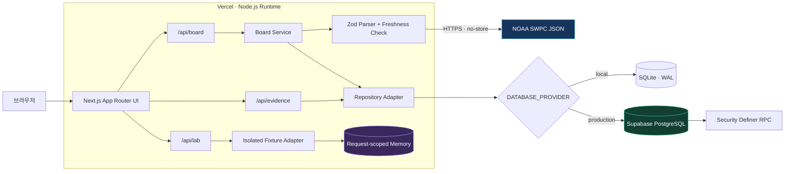
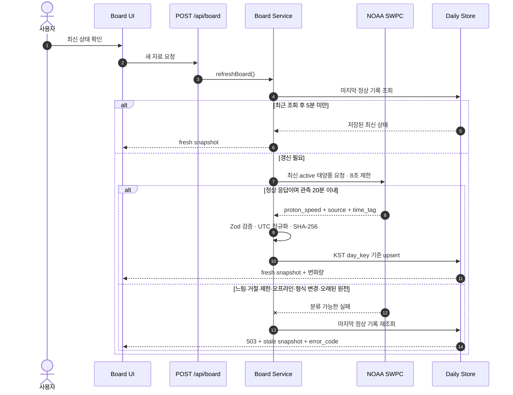
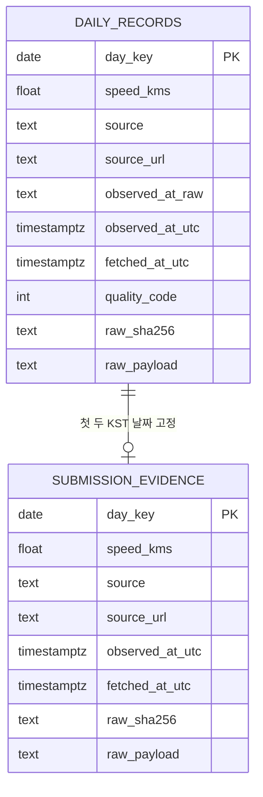

# COSMIC PULSE

> 태양풍의 현재 값보다 **그 값이 언제, 어디서 왔고 실패 뒤에도 믿을 수 있는지**를 보여주는 실시간 정보판

[](https://nextjs.org/)
[](https://react.dev/)
[](https://www.typescriptlang.org/)
[](https://vitest.dev/)
[](https://real-info-board.vercel.app)

[서비스 바로가기](https://real-info-board.vercel.app) · [실제 기록 근거](https://real-info-board.vercel.app/evidence) · [장애 재생 실험실](https://real-info-board.vercel.app/lab)

COSMIC PULSE는 NOAA SWPC의 공개 태양풍 자료를 하루 한 줄의 관측 일지로 바꿉니다. 값과 단위만 보여주는 대시보드에서 한 단계 더 나아가 출처, 관측 시각, 조회 시각, KST 날짜, 원자료 해시를 함께 보존합니다. 원천이 느리거나 끊겨도 마지막 정상값을 지우지 않고 데이터 상태와 다음 행동을 설명합니다.

## 제품이 해결하는 문제

실시간 정보 화면은 정상일 때보다 데이터가 오지 않을 때 신뢰가 흔들립니다. 새 값이 없다는 사실, 화면의 값이 마지막 정상값이라는 사실, 다시 확인할 방법이 서로 구분되지 않으면 사용자는 오래된 수치를 현재값으로 오해할 수 있습니다.

COSMIC PULSE는 다음 원칙으로 이 문제를 다룹니다.

- **출처가 보이는 값:** NOAA 원천, 관측기, 단위, 관측 시각과 조회 시각을 함께 표시합니다.
- **날짜별 한 건:** `Asia/Seoul` 날짜를 키로 사용해 같은 날의 중복 행을 만들지 않습니다.
- **실패해도 보존:** 원천 장애 시 마지막 정상값과 원래 시각을 유지하고 `stale` 상태를 표시합니다.
- **검증 가능한 변화:** 서로 다른 실제 KST 날짜 두 건과 변화량을 화면과 근거 페이지에서 대조합니다.
- **시험 데이터 격리:** 장애 fixture는 요청별 메모리 저장소에서만 실행하고 운영 DB에 기록하지 않습니다.

## 핵심 화면

| 경로 | 역할 | 확인할 수 있는 것 |
| --- | --- | --- |
| [`/`](https://real-info-board.vercel.app) | 태양풍 관측 일지 | 최신 속도, 전일 대비 변화, 출처·시각·상태, NASA SDO 193Å 태양 이미지 |
| [`/evidence`](https://real-info-board.vercel.app/evidence) | 실제 기록 근거 | 서로 다른 실제 KST 날짜 두 건, 원자료 SHA-256, 재계산 변화량 |
| [`/lab`](https://real-info-board.vercel.app/lab) | 장애 재생 실험실 | 느림·거절·호출 제한·오프라인·형식 변경, 마지막값 보존, D2 복구 |

화면은 우주 정거장의 관측 콘솔을 모티브로 구성했습니다. 장식보다 데이터 상태의 우선순위를 높이고, PC와 모바일에서 동일한 정보 계층을 유지합니다.

## 시스템 아키텍처



애플리케이션 계층은 저장소 구현을 직접 알지 않습니다. `DATABASE_PROVIDER`에 따라 로컬에서는 SQLite, Vercel에서는 Supabase 어댑터가 같은 도메인 모델을 반환합니다. 장애 실험실은 별도의 메모리 저장소를 생성하므로 합성값이 실제 관측 기록에 섞일 수 없습니다.

## 실제 조회와 장애 복구 흐름



장애가 발생하면 API는 오류를 숨기지 않습니다. `slow_response`, `upstream_denied`, `rate_limited`, `offline`, `format_changed`, `source_stale` 중 하나를 반환하고, UI는 마지막 정상값·원래 관측 시각·사용자가 취할 행동을 함께 보여줍니다.

## 데이터 무결성 설계



- `day_key`를 기본키로 두어 같은 KST 날짜의 성공 조회는 새 행 대신 최신 버전을 갱신합니다.
- 더 오래된 `fetched_at_utc` 응답은 기존 기록을 덮어쓰지 못합니다.
- 제출 근거는 서로 다른 첫 두 날짜만 보존하고, PostgreSQL advisory lock으로 동시 요청 경쟁을 막습니다.
- 원자료 전체의 SHA-256을 저장해 정규화된 수치가 어떤 응답에서 왔는지 추적할 수 있습니다.

## API

| Method | Endpoint | 설명 | 주요 응답 |
| --- | --- | --- | --- |
| `GET` | `/api/board` | 저장된 관측 상태 조회 | `status`, 최신·이전 기록, 변화량 |
| `POST` | `/api/board` | 필요할 때 NOAA 갱신 후 일별 저장 | 정상 `fresh`, 장애 `503 + stale` |
| `GET` | `/api/evidence` | 고정된 실제 KST 2일 근거 조회 | 기록 수, 완료 여부, 재계산 변화량 |
| `GET` | `/api/lab` | 대체 시험 패키지 메타데이터 조회 | package ID, 공식 자료 제공 여부, 계약 URL |
| `POST` | `/api/lab` | 격리된 장애 또는 복구 fixture 재생 | 오류 코드, 행 변화, 상태 보존, 저장소 격리 |

## 기술 선택과 판단

| 선택 | 이유 | 고려한 한계 |
| --- | --- | --- |
| Next.js App Router | UI와 서버 API를 한 저장소에서 관리하고 Vercel Node 런타임에 배포 | 동적 API는 정적 캐시 대신 명시적인 갱신 정책이 필요 |
| NOAA SWPC | 로그인과 비밀키 없이 열리는 공공 우주기상 JSON 제공 | 외부 원천의 지연·형식 변경을 애플리케이션에서 흡수해야 함 |
| Zod | 외부 JSON을 저장하기 전에 런타임 계약 검증 | 원천 계약이 바뀌면 스키마와 오류 안내를 함께 갱신해야 함 |
| SQLite + Supabase | 로컬 진입 장벽을 낮추면서 서버리스 운영의 영속성 확보 | 두 어댑터가 같은 저장 규칙을 지키는 테스트가 필요 |
| 마지막 정상값 보존 | 실패 화면에서도 사용자가 직전 사실을 확인 가능 | 반드시 `stale`과 시각을 함께 보여야 오해를 막을 수 있음 |
| 상관관계 분석 제외 | 24시간 범위에서 우주 자료와 금융 변동의 인과를 암시하지 않기 위함 | 현재 범위는 관측 사실과 데이터 신뢰성에 집중 |

## 테스트와 검증

```bash
npm run typecheck
npm run lint
npm test
npm run build
```

현재 기준으로 TypeScript, ESLint, 프로덕션 빌드와 **Vitest 7개 파일·16개 테스트**를 통과했습니다. 테스트는 다음 경계를 확인합니다.

- NOAA 응답 선택·정규화·형식 변경 처리
- KST 날짜 경계와 같은 날짜 upsert
- 5분 갱신 제한과 동시 요청 단일화
- SQLite·Supabase 저장 규칙
- 실패 5종의 `stale`, 행 `1→1`, 마지막 정상 상태 보존
- D2 복구의 `fresh`, 행 `1→2`, 중복 실행 방지
- 대체 패키지 manifest의 SHA-256 일치

헌법 기준별 판정과 운영 증거는 [검증 근거 엑셀](./outputs/01a08555-6f7c-7911-8b1c-f21a1a8ea9c3/COSMIC_PULSE_헌법_준수_테스트_근거.xlsx)에서 확인할 수 있습니다. 현재 판정은 **27/27 통과**입니다.

### 시험자료 투명성

헌법이 참조한 공식 T04 시험자료와 제공처는 프로젝트에 포함되지 않았습니다. 프로젝트 소유자 승인에 따라 공개 대체 패키지 [`ALT-T04-COSMIC-PULSE-V1`](./assets/studio-task-assets/t04-real-information-board/)로 같은 관찰 가능한 실패·보존·복구 계약을 검증했습니다. README, 공개 계약, asset manifest와 SHA-256을 함께 제공하며 공식 자료로 표현하지 않습니다.

## 로컬 실행

요구 환경은 Node.js 20.9 이상과 npm입니다.

```bash
git clone https://github.com/hyeseong-dev/real_info_board.git
cd real_info_board
npm install
copy .env.example .env.local
npm run dev
```

macOS와 Linux에서는 환경 파일 복사 명령으로 `cp .env.example .env.local`을 사용합니다. 개발 서버는 기본적으로 [http://localhost:3000](http://localhost:3000)에서 열립니다.

### 환경 변수

| 변수 | 필수 조건 | 설명 |
| --- | --- | --- |
| `DATABASE_PROVIDER` | 항상 | `sqlite` 또는 `supabase` |
| `SQLITE_FILENAME` | SQLite 사용 시 | `.data/` 안에 생성할 파일명 |
| `SUPABASE_URL` | Supabase 사용 시 | Supabase 프로젝트 URL |
| `SUPABASE_SECRET_KEY` | Supabase 사용 시 | 서버 전용 secret key |

Supabase를 사용할 때는 먼저 [`supabase/schema.sql`](./supabase/schema.sql)을 적용합니다. 비밀 키는 서버 환경 변수로만 설정하며 `NEXT_PUBLIC_*` 변수나 클라이언트 코드에 넣지 않습니다.

## 프로젝트 구조

```text
app/
├─ api/board/          실제 조회·갱신 API
├─ api/evidence/       실제 2일 근거 API
├─ api/lab/            격리 장애 재생 API
├─ evidence/           근거 화면
└─ lab/                장애 재생 화면
lib/
├─ board.ts            갱신·신선도·실패 정책
├─ noaa.ts             원천 호출·검증·정규화
├─ repository.ts       저장소 선택 경계
├─ store.ts            SQLite 어댑터
├─ supabase-store.ts   Supabase 어댑터
└─ synthetic.ts        승인 대체 fixture와 격리 저장소
assets/studio-task-assets/
└─ t04-real-information-board/  대체 시험 계약·manifest
supabase/schema.sql             운영 테이블·원자적 저장 RPC
constitution.txt                변경하지 않는 프로젝트 원칙
```

## 빠른 리뷰 순서

1. [운영 홈](https://real-info-board.vercel.app)에서 `최신 상태 확인`을 눌러 값·단위·출처·두 시각·KST를 확인합니다.
2. [실제 기록 근거](https://real-info-board.vercel.app/evidence)에서 두 날짜의 값과 변화량, 원자료 해시를 대조합니다.
3. [장애 재생 실험실](https://real-info-board.vercel.app/lab)에서 실패 카드 하나를 실행해 `stale`과 마지막값 보존을 확인한 뒤 D2 복구를 실행합니다.

상세 기획과 제출 기준은 [프로젝트 사전 검토서](./PROJECT_PREFLIGHT_REVIEW.md), [제출 정보](./SUBMISSION.md), 원문 [constitution.txt](./constitution.txt)에 정리되어 있습니다.
